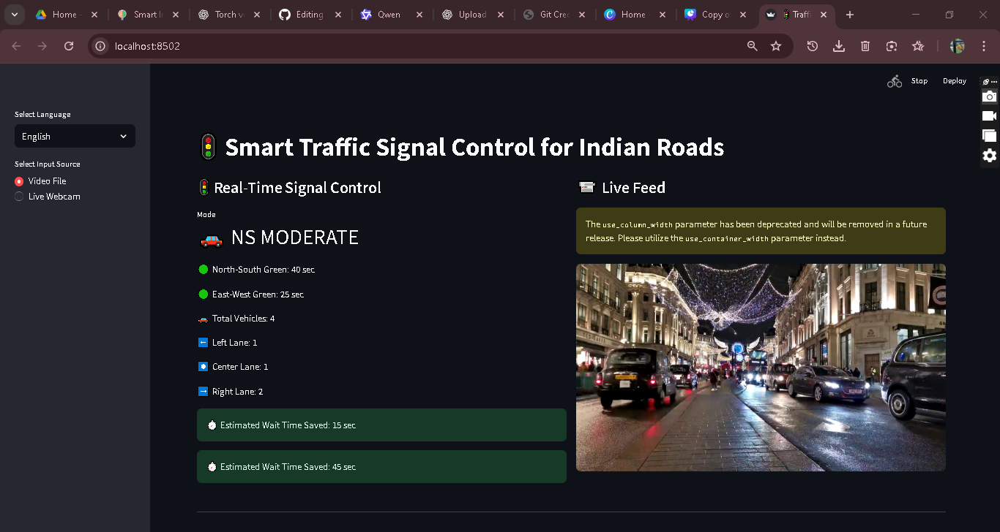
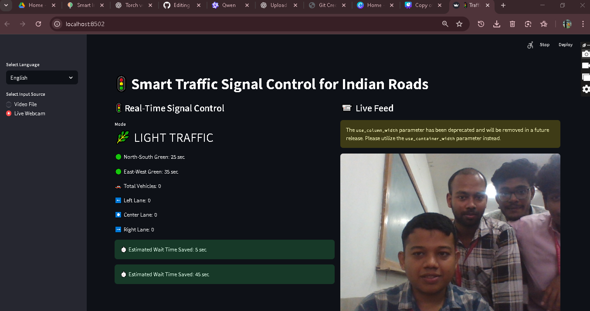

## 🚦 Smart Traffic Management System  
[](https://opensource.org/licenses/MIT)
[](https://www.python.org)
[](https://flask.palletsprojects.com/)
[](https://github.com/Naereen/badges)

> A real-time smart traffic management system developed for **Smart India Hackathon (SIH)** to reduce urban congestion using adaptive signal control, traffic prediction, and AI-based analytics.

 <!-- Replace with actual image if available -->
 <!-- Replace with actual image if available -->

## 🔍 Overview

Urban traffic congestion leads to increased travel time, pollution, and fuel consumption. This **Smart Traffic Management System (STMS)** leverages real-time data from sensors/cameras and historical traffic patterns to dynamically adjust traffic signal timings, predict congestion, and optimize vehicle flow across intersections.

Built during **Smart India Hackathon**, this solution aims to make city transportation smarter, safer, and more efficient using modern technologies such as **machine learning**, **IoT**, and **real-time web interfaces**.

---

## ✨ Features

✅ **Dynamic Signal Control**  
   - Adjusts traffic light durations based on real-time vehicle density at each lane.

✅ **Congestion Detection**  
   - Uses computer vision (or simulated data) to detect traffic buildup and trigger alerts.

✅ **Traffic Flow Prediction**  
   - Predicts peak hours and congestion using ML models (e.g., LSTM, Random Forest).

✅ **Web Dashboard**  
   - Real-time monitoring of all intersections via an intuitive admin dashboard.

✅ **Emergency Vehicle Priority**  
   - Grants green light priority to ambulances/fire engines via RFID/GPS detection.

✅ **Data Analytics & Reporting**  
   - Visualize daily traffic trends, bottlenecks, and system performance.

---

## 🛠️ Tech Stack

| Component         | Technology Used                          |
|------------------|------------------------------------------|
| Backend          | Python, Flask                            |
| Frontend         | HTML, CSS, JavaScript, Bootstrap         |
| Database         | SQLite / MySQL                           |
| Machine Learning | Scikit-learn, TensorFlow/Keras (optional)|
| Simulation       | OpenCV (for object detection), YOLO      |
| Deployment       | Docker (optional), Gunicorn              |
| Hosting          | Local Server / Cloud (for demo)          |

---

## 📦 Installation & Setup

### Prerequisites
- Python 3.8 or higher
- pip package manager
- Git

### Steps

1. **Clone the repository**
   ```bash
   git clone https://github.com/subham711-dot/Smart-Traffic-Management-System-SIH.git
   cd Smart-Traffic-Management-System-SIH
   ```

2. **Create virtual environment (recommended)**
   ```bash
   python -m venv venv
   source venv/bin/activate    # On Windows: venv\Scripts\activate
   ```

3. **Install dependencies**
   ```bash
   pip install -r requirements.txt
   ```

4. **Run the application**
   ```bash
   python app.py
   ```
   Visit `http://localhost:5000` in your browser.

---

## 🖼️ Project Structure
```
Smart-Traffic-Management-System-SIH/
│
├── app.py                    # Main Flask application
├── config.py                 # Configuration settings
├── models/                   # ML models & training scripts
│   ├── train_model.py
│   └── predict.py
├── static/                   # CSS, JS, images
│   ├── css/
│   ├── js/
│   └── images/
├── templates/                # HTML templates
│   ├── index.html
│   ├── dashboard.html
│   └── ...
├── utils/                    # Helper functions
│   ├── camera_feed.py
│   └── signal_controller.py
├── data/                     # Sample datasets/logs
├── requirements.txt          # Dependencies
└── README.md
```

---

## 🎯 How It Works

1. **Input**: Live video feed from CCTV cameras or sensor data (simulated).
2. **Processing**: Detect vehicles using OpenCV/YOLO and calculate lane-wise density.
3. **Decision Engine**: Use ML model to predict optimal signal timing.
4. **Output**: Send updated signal durations to traffic lights.
5. **Monitoring**: Admin dashboard displays live stats and allows manual override.

---

## 🤝 Contributing

Contributions are welcome! Please read our [Contribution Guidelines](CONTRIBUTING.md) before submitting a pull request.

1. Fork the repo
2. Create your feature branch (`git checkout -b feature/amazing-feature`)
3. Commit your changes (`git commit -m 'Add amazing feature'`)
4. Push to the branch (`git push origin feature/amazing-feature`)
5. Open a Pull Request

---

## 📄 License

This project is licensed under the **MIT License** – see the [LICENSE](LICENSE) file for details.

---

## 📬 Contact

For queries or collaboration, reach out to:

👤 **Subham Dev R**  
📧 subhamdev711@gmail.com  
🔗 [GitHub Profile](https://github.com/subham711-dot)  

*Made with ❤️ for smarter cities.*
